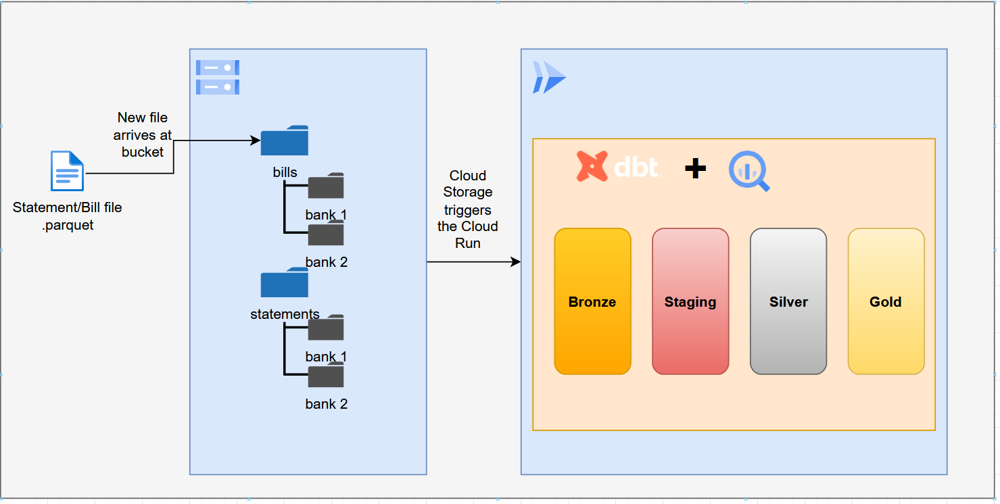

# personal-finance-analysis
When using finance tracker apps, I was disapointed by the lack of control over my data. In order to fix that, I developed this analytical approach to all my finances.



## Description
This project is a comprehensive tool designed to help individuals analyze and manage their personal finances. By leveraging the power of BigQuery and dbt, users can efficiently process and analyze their financial statements and bills. The tool provides insights into spending patterns, income sources, and overall financial health, enabling users to make informed financial decisions.

## Table of Contents
- [Installation](#installation)
- [Usage](#usage)


## Installation
### Setup the environment
Clone the repository:
```bash
git clone https://github.com/03felipesampaio/personal-finance-analysis.git
```

Create a virtual environment and install required packages:
```bash
python3 -m venv dbt-env
source ./dbt-env/bin/activate
pip install -r requirements.txt
```

Setup gcloud SDK (We are assuming that you are running this on your personal machine):
1. Follow instructions from https://cloud.google.com/sdk/docs/install
2. Setup your credentials
```bash
gcloud init
gcloud auth application-default login
```

Setup your profiles.yml file (usually is on ~/.dbt/profiles.yml):

1. Follow instructions from [dbt official documentation for Big Query.](https://docs.getdbt.com/docs/core/connect-data-platform/bigquery-setup)


Check if everything is working
```bash
cd personal_finance_analysis
dbt debug
```

## Usage
To start the application, run:
```bash
cd personal_finance_analysis
dbt run
```